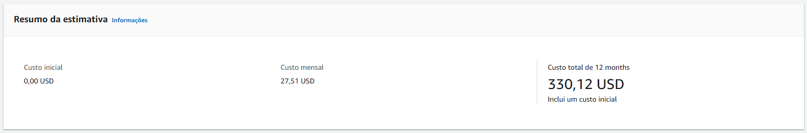
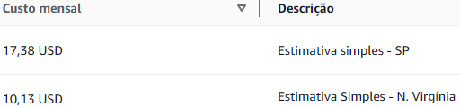

# FIAP - Faculdade de Informática e Administração Paulista

<p align="center">
<a href= "https://www.fiap.com.br/"></a>
</p>

<br>

## Sistema de Monitoramento e Previsão de Safra usando Machine Learning

## Grupo: FarmTech Solutions

## 👨‍🎓 Integrantes: 
- <a href="https://www.linkedin.com/in/gabriel-oliveira-b6353a16b/">Gabriel Oliveira dos Santos</a>
- <a href="https://www.linkedin.com/in/roberson-pedrosa-304ab523a/">Roberson Pedrosa de Oliveira Junior</a>
- <a href="https://www.linkedin.com/in/arthur-bruttel-7171b8381">Arthur Bruttel Nascimento</a> 
- <a href="https://www.linkedin.com/in/jonviotti/">Jonatan Viotti Rodrigues da Silva</a> 
- <a href="https://www.linkedin.com/in/eusamuelrocha/">Samuel Nicolas Oliveira Rocha</a>

## Vídeo demonstrativo:

- <a href="https://youtu.be/lI096I3a-KI"> Execução e dados - Jupyter Notebook</a>
- <a href="https://youtu.be/IwPJJlkNaDY?si=h9mY4XDt-yoDEiHJ"> Estimativa AWS Calculator</a>
- - <a href="https://youtu.be/IwPJJlkNaDY?si=h9mY4XDt-yoDEiHJ"> Ir Além - Sistema de Coleta e Comunicação de Dados Usando ESP32 Integrado ao Wi-Fi</a>

## 👩‍🏫 Professores:
### Tutor(a) 
- <a href="https://www.linkedin.com/in/sabrina-otoni-22525519b/">Sabrina Otoni</a>
### Coordenador(a)
- <a href="https://www.linkedin.com/company/inova-fusca">André Godoi Chiovato</a>

---

## 📜 Descrição - Entrega 1

Este projeto de Ciência de Dados é parte integrante de uma atividade acadêmica voltada para a FarmTech Solutions. A solução utiliza técnicas avançadas de Inteligência Artificial para analisar dados climáticos e produtivos de uma fazenda, permitindo a gestão otimizada do cultivo por meio de scripts desenvolvidos em Python no ambiente Jupyter Notebook.

---

## 1. Introdução

O projeto visa aplicar modelos de Machine Learning sobre um dataset de rendimento agrícola, integrando duas frentes principais de estudo:

Aprendizado Não Supervisionado (Fase 5): Utilização de algoritmos de Clusterização (K-Means) para identificar perfis de produtividade, tendências e outliers na operação rural.

Aprendizado Supervisionado (Fase 4): Implementação e comparação de modelos de Regressão (como Random Forest e Decision Trees) para prever o rendimento futuro das safras com base em variáveis climáticas como precipitação, temperatura e umidade.

A solução final entrega uma análise robusta que transforma dados históricos em insights preditivos, auxiliando na redução de incertezas e no planejamento estratégico da produção agrícola.

## 2. Fontes Utilizadas

A base de dados foi analisada a partir do arquivo "crop_yield.csv", conforme exigido pela atividade

## 📁 Estrutura do Projeto

* Arquivo `/entraga1/.ipynb` principal com a análise, clusterização e regressão

* Base `/entrega1/crop_yield.csv` com dados climáticos e de rendimento da fazenda.

## 2. Tecnologias Utilizadas

* Python 3.x
* Jupyter Notebook
* Pandas (Manipulação de Dados)
* Scikit-Learn (Machine Learning)
* GitHub (Controle de Versão e Hospedagem)

---

## 🗂️ Localização dos Arquivos de Dados

Os arquivos da base de dados e o script estão localizados no repositório:

* **Base de Dados:** [Acessar crop_yield.csv](entrega1/crop_yield.csv)

* **Jupyter Notebook:** [Abrir Projeto](entrega1/GabrielOliveira_RM567166_RobersonPedrosa_RM567216_ArthurBruttel_RM568484_JonatanViotti_RM566787_SamuelRocha_RM568552_pbl_fase5.ipynb.ipynb)

---

## 🎯 Fases do Projeto Cobertas

Este trabalho integra os conhecimentos das seguintes fases do curso:
* **Fase 5 (Clusterização):** Identificação de perfis de produtividade e análise de outliers via K-Means (Machine Learning Sem Supervisão).
* **Fase 4 (Regressão):** Implementação e comparação de modelos preditivos para estimar a colheita (Machine Learning Supervisionado).

---

## 📜 Descrição - Entrega 2

---

Nessa segunda entrega, foi solicitada uma estimativa de custo on-demand (sob demanda) de uma estrutura de Linux simples em nuvem no servidor do AWS Calculator — ferramenta da Amazon Web Services que permite estimar custos de arquitetura em nuvem.

## 1. Introdução

Para a estimativa, foi necessária a configuração manual nas regiões solicitadas **(São Paulo - BR e Virgínia do Norte - EUA)** com base nos seguintes itens:

- 2 CPUs
- 1 GiB
- Até 5 GB de rede
- 50 GB de armazenamento 
- Restrições legais para armazenamento no exterior

## 2. Configurações

**Serviço Utilizado:** EC2

O EC2 oferece uma ótima performance e preço, atendendo a área de treinamento de Machine Learning e, também, os itens solicitados conforme listados na introdução, além de possuir uma infraestrutura confiável e escalável on-demand (sob demanda).

**Locação:** Instância compartilhada

O compartilhamento de instância utiliza uma estrutura física compartilhada entre diversos clientes da AWS, reduzindo significativamente o custo. Como o objetivo do projeto é a hospedagem de uma API simples, não há a necessidade de um isolamento completo.

**Sistema Operacional:** Linux

Escolhido conforme solicitado no projeto.

**Carga de Trabalho:** Uso constante

Como o intuito é a hospedagem em nuvem que coletará os dados dos sensores da entrega 1 para uma futura Machine Learning, é necessária uma workload (carga de trabalho) constante para o processamento contínuo de dados de modo que traga previsões de rendimento mais exatas.

**Número de Instâncias:** 1

O fato de ser uma API simples, tira a necessidade de um maior número, pois uma única instância é suficiente para atender a demanda.

**Tipo de Instância:** t4g.micro

A instância t4g.micro atende aos requisitos da introdução (2 CPUs, 1 GiB, até 5 GB de rede, ) e apresenta um baixo custo sob demanda. Portanto, se torna adequada para aplicações leves e simples.

**Opção de Pagamento:** On-demand

Selecionado conforme solicitado no projeto. 

**Armazenamento:** Amazon Elastic Block Store (Amazon EBS), SSD de uso geral (gp3), capacidade de 50 GB

O EBS é onde ocorre o armazenamento dos bancos de dados e arquivos, nele foi utilizado o gp3 pois atende aplicações gerais e possui um bom equilíbrio entre desempenho e custo. E, conforme solicitado, foi configurado para uma capacidade de armazenamento de 50 GB.

**Snapshots:** Não utilizado

Como o objetivo é apenas estimar o custo da infraestrutura, não foi necessário o uso de snapshots de backup.

**Monitoramento Detalhado:** Não utilizado

A estimativa de uma API simples em nuvem tira a necessidade de um monitoramento detalhado.

**Transferência de Dados:** Não utilizado

Como não foi estipulado um valor de tráfego de rede, a transferência de dados não foi considerada. 

**Custos Adicionais:** Não utilizado

O objetivo da análise foi calcular apenas o custo da infraestrutura principal necessária para hospedar a API.

## 3. Valores da Estimativa

Resumo Geral da Estimativa:



Estimativa Individual:



Gráfico Representativo:


## 4. Tecnologias Utilizadas

**Entrega 2:**

* Python 3.x
* AWS Calculator
* Matplotlib (construção do gráfico)

## 5. Conclusão

A estimativa teve um custo anual de **330,12 USD** com um custo mensal de **17,38 USD** para São Paulo e **10,13 USD** para Virgínia do Norte, totalizando um custo geral mensal de **27,51 USD**. Sendo assim, a região da Virgínia do Norte apresenta um custo **41,7%** inferior ao da região de São Paulo para a mesma configuração de infraestrutura. Contudo, mesmo que Virgínia do Norte possua um valor inferior, a região de São Paulo pode ser considerada melhor devido às restrições legais relacionadas à transferência internacional de dados e à necessidade de menor latência no acesso às informações coletadas pelos sensores.

# Ir Além - Sistema de Coleta e Comunicação de Dados Usando ESP32 Integrado ao Wi-Fi

## 📋 Descrição do Projeto

Este projeto desenvolve um sistema IoT completo para coleta de dados climáticos em ambientes agrícolas, utilizando o microcontrolador ESP32 com comunicação Wi-Fi e sensores para monitoramento em tempo real.

---

## 1. Definição dos Sensores e Contexto

### Sensores Escolhidos:

| Sensor | Função | Justificativa |
|--------|--------|----------------|
| **DHT11** | Temperatura e Umidade | Sensor de baixo custo, amplamente utilizado em projetos IoT agrícolas para monitoramento climático |
| **LDR** (Light Dependent Resistor) | Luminosidade | Mede a intensidade luminosa do ambiente, essencial para análise de fotossíntese e ciclo solar nas plantações |

### Objetivo do Projeto:

Desenvolver um sistema de monitoramento ambiental em tempo real para fazendas inteligentes (Smart Farming), coletando dados de temperatura, umidade e luminosidade que serão utilizados para:
- Prevenção de condições climáticas adversas
- Otimização da irrigação
- Análise de condições ideais para colheita
- Integração com modelos de Machine Learning para previsão de produtividade

---

## 2. Arquitetura do Sistema


## 2. Montagem dos componentes


---

## 3. Hardware Necessário

### Componentes:
- 1x ESP32 DevKit (ou qualquer variante)
- 1x Sensor DHT11 (temperatura e umidade)
- 1x Resistor LDR (sensor de luz)
- 1x Resistor de 10kΩ (para divisor de tensão do LDR)
- Fios de conexão
- Protoboard (opcional)

### Conexões:

| Pino ESP32 | Componente |
|------------|------------|
| GPIO 4     | DHT11 (Data) |
| GPIO 34    | LDR (Analog) |
| 3.3V       | DHT11/LDR (VCC) |
| GND        | DHT11/LDR (GND) |

---

## 4. Software e Tecnologias

### ESP32 (C/C++):
- **Biblioteca WiFi.h**: Comunicação Wi-Fi do ESP32
- **Biblioteca PubSubClient**: Cliente MQTT para publicação de dados
- **Biblioteca DHT**: Leitura do sensor DHT11

### Servidor (Python):
- **Flask**: Servidor web para dashboard
- **Paho-MQTT**: Cliente MQTT para receber dados
- **Broker MQTT**: HiveMQ (público) em broker.hivemq.com:1883

---

## 5. Instalação e Configuração

### Passo 1: Instale as dependências Python

```bash
pip install -r requirements.txt
```

### Passo 2: Configure o código ESP32

Edite o arquivo `esp32_sensor.ino` e altere as credenciais Wi-Fi:

```cpp
const char* ssid = "SUA_REDE_WIFI";
const char* password = "SUA_SENHA_WIFI";
```

### Passo 3: Programe o ESP32

1. Abra o Arduino IDE ou PlatformIO
2. Instale as bibliotecas necessárias:
   - PubSubClient
   - DHT sensor library
3. Compile e carregue o código no ESP32

### Passo 4: Execute o servidor Dashboard

```bash
python servidor_dashboard.py
```

### Passo 5: Acesse o Dashboard

Abra o navegador e acessa: `http://localhost:5000`

---

## 6. Como Exportar o Localhost com ngrok

Para tornar o dashboard acessível pela internet:

### Instalação do ngrok:

1. Baixe em: https://ngrok.com/download
2. Descompacte e configure:
```bash
unzip ngrok.zip
./ngrok authtoken SEU_TOKEN
```

### Execução:

```bash
# Terminal 1: Inicie o servidor Python
python servidor_dashboard.py

# Terminal 2: Exporte com ngrok
./ngrok http 5000
```

O ngrok mostrará uma URL pública que você pode compartilhar!

---

## 7. Estrutura de Arquivos

```
ir-alem/
├── esp32_sensor.ino        # Código fonte do ESP32
├── servidor_dashboard.py   # Servidor Python com dashboard
├── requirements.txt        # Dependências Python
```

---

## 8. Formato dos Dados JSON

O ESP32 envia os dados no seguinte formato:

```json
{
  "temperatura": 25.5,
  "umidade": 60.0,
  "luminosidade": 512
}
```

---

## 9. Tópicos MQTT

| Tópico | Descrição |
|--------|-----------|
| `farmtech/sensores` | Tópico onde o ESP32 publica os dados dos sensores |

---

## 10. Possíveis Extensões

- **Integração com Firebase**: Armazenamento permanente dos dados
- **Dashboard avançado**: Gráficos históricos com Chart.js
- **Alertas**: Notificações quando valores ultrapassarem limites
- **Multi-sensores**: Adicionar mais ESP32s em diferentes pontos da fazenda
- **Machine Learning**: Usar dados para predição de produtividade

---

## 📚 Referências

- [Documentação ESP32](https://docs.espressif.com/)
- [Biblioteca DHT](https://github.com/adafruit/DHT-sensor-library)
- [HiveMQ Broker](https://www.hivemq.com/public-mqtt-broker/)
- [Flask Documentation](https://flask.palletsprojects.com/)

---

## 📖 Pontos Gerais

## 1. Estrutura do Projeto

```
FarmTech-Cloud-Computing/
├── assets/
│   ├── imagens/
│   │   ├── arquitetura_IoT.svg
│   │   ├── schema_IoT.jpg
│   │   ├── estimativa_individual.png
│   │   ├── grafico_custo.png
│   │   └── resumo_estimativa.png
│   └── logo/
│       └── logo-fiap.png
├── entrega1/
│   ├── crop_yield.csv
│   └── GabrielOliveira_RM567166_(...).ipynb
├── entrega2/
│   └── grafico.py
├── ir-alem/
│   ├── esp32_sensor.ino
│   ├── servidor_dashboard.py
│   └── requirements.txt
├── LICENSE
├── README.MD
└── todo.md
```

---

## 📋 Licença

Este projeto está licenciado sob a licença MIT.  
Consulte o arquivo LICENSE para mais detalhes.

Este repositório foi baseado no template da FIAP, originalmente licenciado sob Creative Commons Attribution 4.0.

<p xmlns:cc="http://creativecommons.org/ns#" xmlns:dct="http://purl.org/dc/terms/"><a property="dct:title" rel="cc:attributionURL" href="https://github.com/agodoi/template">MODELO GIT FIAP</a> por <a rel="cc:attributionURL dct:creator" property="cc:attributionName" href="https://fiap.com.br">Fiap</a> está licenciado sobre <a href="http://creativecommons.org/licenses/by/4.0/?ref=chooser-v1" target="_blank" rel="license noopener noreferrer" style="display:inline-block;">Attribution 4.0 International</a>.</p>
